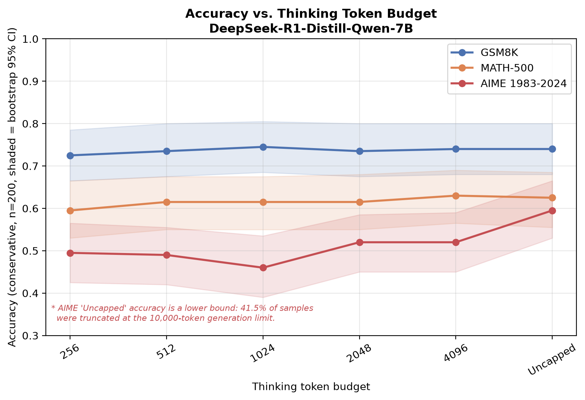
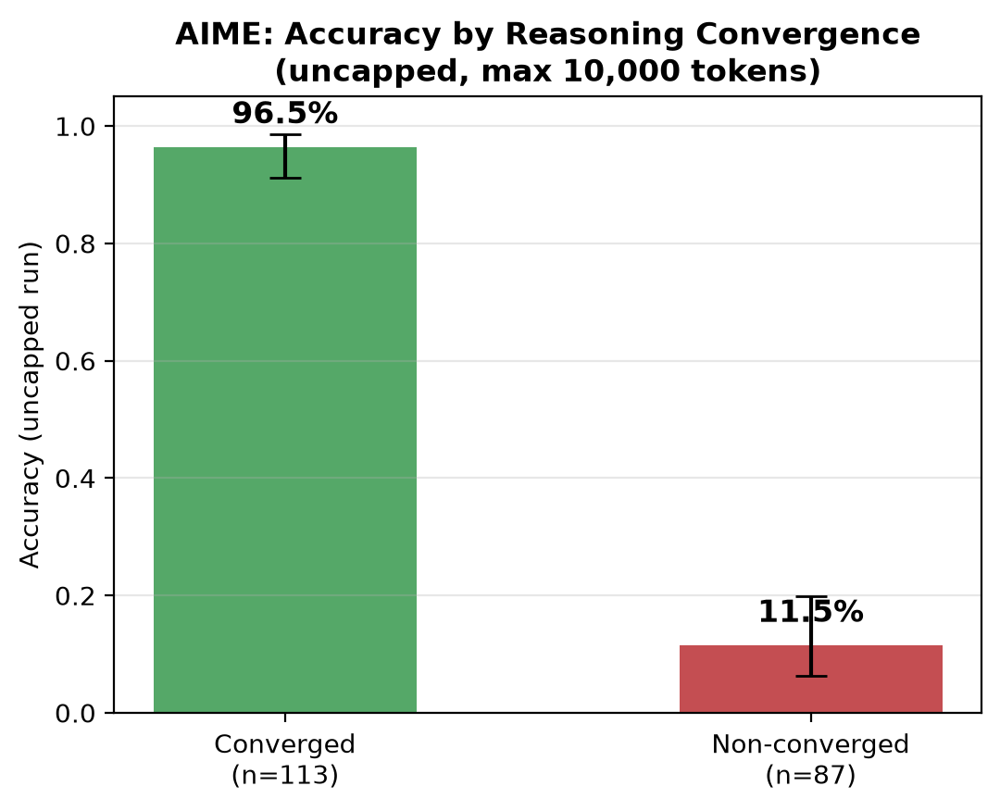
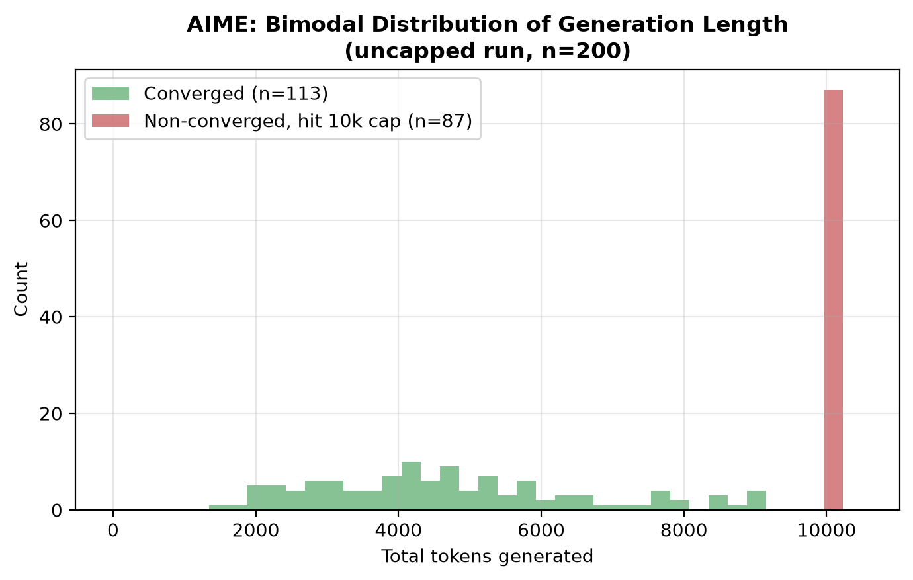
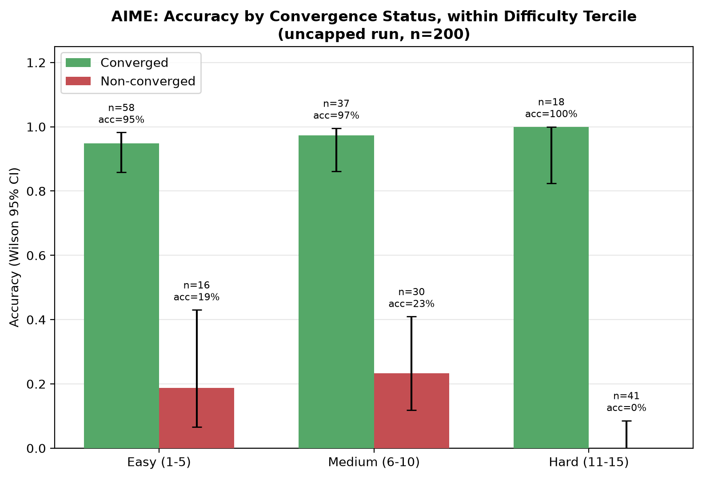
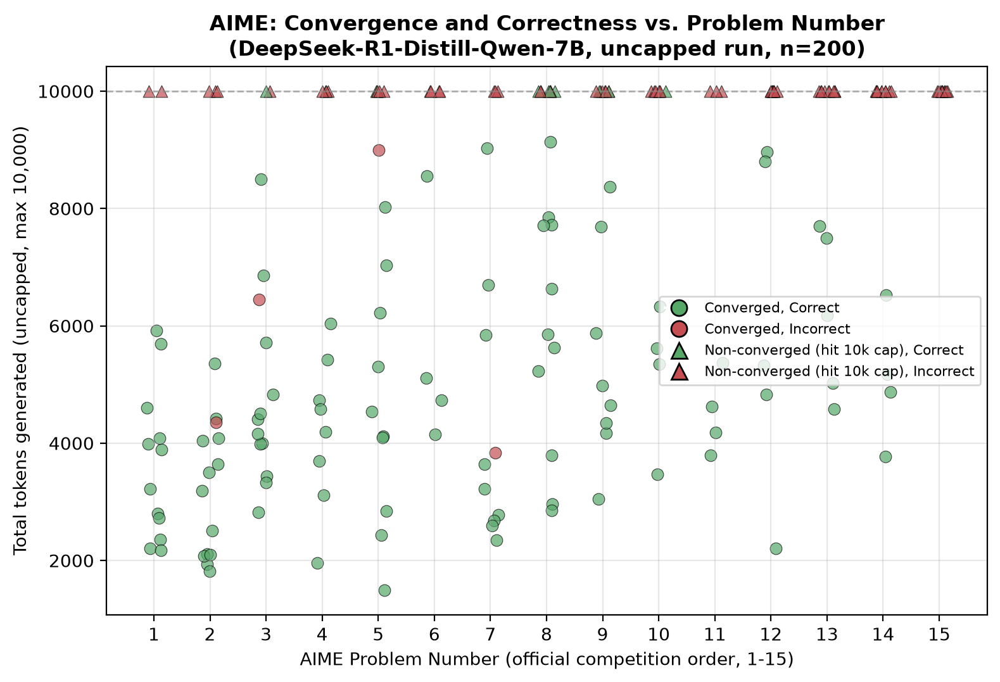

# Token Efficiency in Math Reasoning

**Does giving a reasoning model more "thinking" tokens actually improve its
accuracy on math problems — and does the answer depend on how hard the
problem is?**

This project measures the minimum thinking-token budget (**B\***) at which
[DeepSeek-R1-Distill-Qwen-7B](https://huggingface.co/deepseek-ai/DeepSeek-R1-Distill-Qwen-7B)
reaches 95% of its uncapped accuracy, across three math benchmarks spanning a
difficulty gradient: **GSM8K** (grade-school arithmetic), **MATH-500**
(competition math), and **AIME 1983-2024** (US Math Olympiad qualifier,
the hardest of the three).

The original hypothesis was that B\* would scale smoothly with difficulty
(GSM8K < MATH-500 < AIME). **It didn't.** Instead we found something more
interesting — see [Findings](#findings) below.

---

## TL;DR

| Benchmark | B\* | 95% CI | Uncapped Accuracy |
|---|---|---|---|
| GSM8K | **256** | [256, 512] | 0.740 |
| MATH-500 | **256** | [256, 4096] | 0.625 |
| AIME | **None** (never converges) | — | 0.595\* |

\* lower bound — see [Limitations](#limitations)

- On **GSM8K and MATH-500**, accuracy is flat across every budget we tested,
  including uncapped. More thinking tokens don't help.
- On **AIME**, accuracy never reaches 95% of its uncapped value at any tested
  budget (256–4096). But this isn't because AIME "needs more budget" in a
  continuous sense — it's because **AIME splits into two populations**:
  problems the model converges on quickly (~4,100 tokens avg, 96.5% accuracy)
  and problems where it never stops "thinking" even after 10,000 tokens
  (11.5% accuracy). There's no middle ground.

---

## Findings

### 1. Plateau effect on GSM8K and MATH-500

Both benchmarks reach 95% of their uncapped accuracy at the **smallest
budget we tested (256 tokens)**. Accuracy curves are statistically flat
(overlapping bootstrap 95% CIs) all the way to uncapped.



*Figure 1 — Accuracy vs. thinking token budget, all three benchmarks
(n=200 per point, shaded bands = bootstrap 95% CI). GSM8K and MATH-500 are
flat. AIME sits lower throughout 256–4096 and jumps only at uncapped — that
jump is decomposed in Figures 2–5 below.*

### 2. AIME doesn't converge to a single B\* — it's bimodal

Looking at the AIME uncapped run (max 10,000 tokens) sample-by-sample:

- **113/200 samples (56.5%) converge naturally** — the model emits `</think>`
  on its own, after an average of ~4,100 tokens — and these samples score
  **96.5% accuracy** (Wilson 95% CI: 91.3–98.6%).
- **87/200 samples (43.5%) never emit `</think>`**, even after 10,000
  tokens — and these score **11.5% accuracy** (Wilson 95% CI: 6.4–19.9%).



*Figure 5 — Overall AIME accuracy split by convergence status. The gap
(96.5% vs 11.5%) is the headline result.*



*Figure 3 — Distribution of total generation length on AIME (uncapped run).
Two distinct clusters: converged samples (~2k–9k tokens) and non-converged
samples pinned at the 10,000-token cap.*

### 3. Convergence predicts accuracy *beyond* difficulty alone

Non-convergence correlates with AIME problem number — problems 1-15 per
year, roughly ordered by difficulty by the competition organizers
(point-biserial r=0.431, p<0.0001, r²=0.186). But difficulty alone doesn't
explain the accuracy gap: **the converged/non-converged split persists, and
widens, within every difficulty tercile** — including the hardest problems,
where converged samples score 100% (n=18) and non-converged samples score 0%
(n=41).



*Figure 4 — The centerpiece result. Within each difficulty tercile
(Easy 1-5, Medium 6-10, Hard 11-15), converged samples vastly outscore
non-converged samples. In the Hard tercile the gap is 100% vs 0%. Note:
the 18 converged Hard-tercile samples come from problems 11-14 — problem 15
never converged in this sample, so it contributes entirely to the
non-converged group.*



*Figure 2 — Per-sample view: total tokens generated vs. AIME problem number,
colored by correctness, shaped by convergence status (circle = converged,
triangle = hit the 10k cap). Non-convergence (triangles) is more common at
higher problem numbers but occurs throughout the range.*

### What this means in practice

A model doesn't gradually get better at AIME-level problems with more
budget. For a given problem, it's effectively in one of two states:

- **"I can do this"** → converges in ~4-5k tokens → ~97% chance of being right
- **"I can't do this"** → never converges, even given 10k tokens → ~12% chance
  of being right (roughly chance-level for AIME's integer answer space)

A practical implication: rather than allocating a uniform large budget,
a deployment system could monitor for `</think>` emission and treat
non-emission by ~5-6k tokens as a signal that the problem is unlikely to be
solved by this model regardless of further budget — useful for early-exit /
routing decisions.

---

## Limitations

- **AIME's "uncapped" run used a practical 10,000-token cap**, not a truly
  unlimited budget. The 41.5% non-convergence rate may partly reflect this
  cap. We did not capture raw reasoning traces, so we can't distinguish
  "stuck in a repetitive loop" from "making slow but coherent progress" for
  non-converged samples — this would require a follow-up run with response
  text saved.
- **Single model.** All results are for DeepSeek-R1-Distill-Qwen-7B. Whether
  the plateau effect and convergence bimodality generalize to other model
  sizes/families (e.g., the 14B/32B distills, QwQ) is untested.
- **n=200 per benchmark.** Some AIME sub-group breakdowns (e.g., per
  problem-number) have small cell counts (as low as n=4).
- Problem number is an imperfect difficulty proxy — it reflects aggregate
  human solve rates from competition organizers, not per-model difficulty.
  The unexplained variance (r²≈0.81) in convergence likely reflects both
  genuine model-specific factors and noise in this proxy.

---

## Repo Structure

```
.
├── eval_token_efficiency.py   # main evaluation script
├── make_figures.py            # figure generation
├── results/                   # per-benchmark, per-budget JSON checkpoints
│   ├── gsm8k_{256,512,1024,2048,4096,uncapped}.json
│   ├── math500_{...}.json
│   ├── aime_{...}.json
│   └── final_summary.json     # B*, bootstrap CIs, accuracy summaries
└── figures/                    # generated plots (figs 1-5)
```

Each entry in a `results/<benchmark>_<budget>.json` file is one sample, with
fields:

| field | meaning |
|---|---|
| `idx` | sample index (fixed seed=42 ordering) |
| `"<budget>"` or `"None"` | `true`/`false` — was the model's answer correct |
| `extracted` | extracted answer string |
| `expected` | ground-truth answer string |
| `total_tokens` | tokens generated |
| `think_end_pos` | position of `</think>` in the output, or `null` if never emitted |
| `hit_budget` | whether the budget-forcing processor fired |
| `hit_max_tokens` | whether generation hit the hard cap (6,000 for budgeted runs, 10,000 for uncapped) |
| `extraction_success` | whether an answer could be extracted at all |

---

## Reproducing this project

### Requirements

- A GPU with ≥24GB VRAM (the model is ~15GB in fp16; budgeted runs need
  headroom for KV cache on long AIME chains). Tested on an RTX A5000.
- Python 3.10+

### Setup

```bash
git clone https://github.com/oladri-renuka/token-efficiency-math-reasoning.git
cd token-efficiency-math-reasoning
pip install transformers accelerate datasets torch matplotlib scipy --break-system-packages -q
```

### Validation run (recommended first — ~20 min, 20 samples)

```bash
python eval_token_efficiency.py --validate
```

Checks that the model loads, the budget-forcing logits processor correctly
forces `</think>` at the target token count, answer extraction works
(extraction rate should be ~100% on GSM8K/MATH-500), and AIME's uncapped
accuracy gate passes (>0%).

### Full run (200 samples × 3 benchmarks × 6 budgets)

```bash
python eval_token_efficiency.py --benchmark all
```

This is **slow** — roughly 60-70 hours on an RTX A5000, dominated by AIME's
uncapped runs (~145-215s/sample). Run inside `tmux` or `screen`; the script
checkpoints every 10 samples and **resumes automatically** if interrupted —
just re-run the same command.

To run a single benchmark (e.g. if you only want to extend/replicate AIME):

```bash
python eval_token_efficiency.py --benchmark aime
```

### Generating figures

```bash
python make_figures.py
```

Reads from `results/`, writes `fig1`–`fig5` to `figures/`, and prints the
B\* summary table, bootstrap CIs, the AIME convergence/non-convergence
accuracy split with Wilson CIs, the tercile breakdown, and the point-biserial
correlation between non-convergence and problem number.

### Key implementation notes if extending this

- **The budget-forcing processor must start in "thinking" mode.**
  DeepSeek's chat template ends the prompt with `<think>\n` already — the
  `<think>` token is part of the *prompt*, not generated, so a processor that
  waits to *see* `<think>` generated will never fire. `BudgetForcingProcessor`
  in this repo initializes `self.thinking = True` to account for this. (This
  was the single bug that invalidated our first full run — see commit
  history if you want the gory details.)
- The `</think>` token ID for DeepSeek-R1-Distill-Qwen-7B is `151649`,
  `<think>` is `151648` — these are hardcoded constants
  (`THINK_START_ID`, `THINK_END_ID`) in `eval_token_efficiency.py`. If you
  swap in a different model, re-derive these via
  `tokenizer.get_added_vocab()`.
- AIME dataset loader uses `gneubig/aime-1983-2024` on HuggingFace (933
  problems total; we sample 200 with seed=42). The columns are `Question` /
  `Answer` / `Problem Number` (not `Problem`/`Answer` as in some other AIME
  dataset repos — this tripped us up initially).
